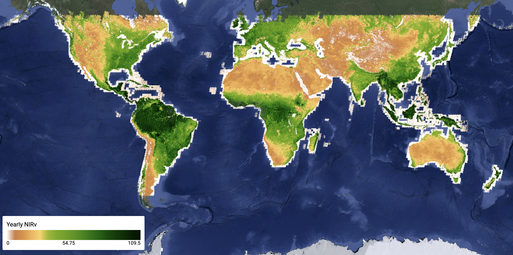
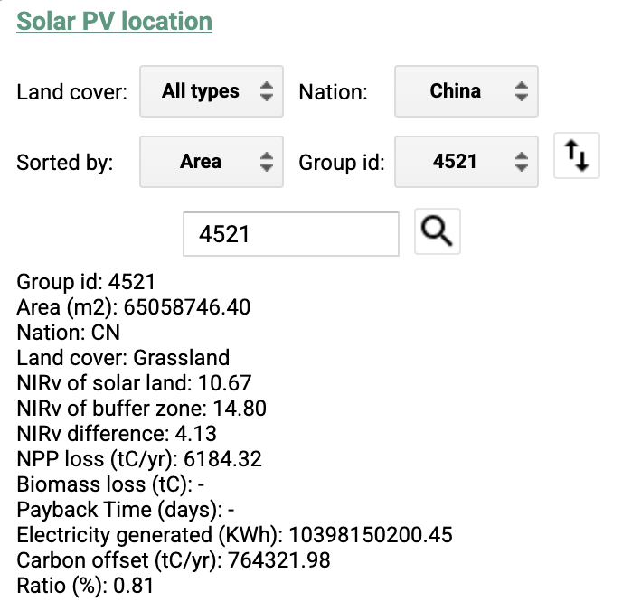
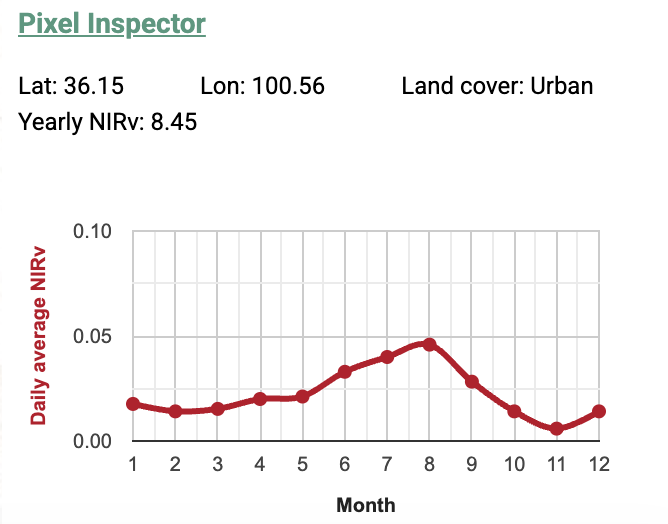

# Unveiling Vegetation Carbon Losses from Global Utility-Scale Solar Photovoltaic Expansion

This is only for visualizing the key dataset and results in the paper '***Unveiling Vegetation Carbon Losses from Global Utility-Scale Solar Photovoltaic Expansion***'.
You can also access the codes for data analysis and visualization at [Solar PV](https://github.com/romawhite/SolarPV) and the codes for future solar pv sitting at [SolarPV_sitting](https://github.com/romawhite/solarpv_siting).
Permission may be required to access the codes, but be granted upon request.
Any question please contact Dr. Wan via the Email :email: roma@link.cuhk.edu.hk

<p align="center">
  
</p>

## Step 1: Entrance
:walking: Go to the website :computer: : https://romawhite90325.users.earthengine.app/view/solarpv
> [!WARNING]
> Sometimes it raises errors because of Earth Engine capacity exceeded.
> Please close the browser and try again!

## Step 2: Data selection
:walking: Choose image to be display, default image is yearly NIRv.

<p align="center">
  
</p>

## Step 3: Solar PV location
:walking: Select ground-mounted utility-scale solar pv (PV<sub>GU</sub>) station to view details.

All PV<sub>GU</sub> are filtered based on the identifier of "group id", and there is two ways to select PV<sub>GU</sub>. 
1. You can select the targeted PV<sub>GU</sub> based on its properties. Or,
```
For example, if you want to view the largest PV<sub>GU</sub> in China, you can choose

Land cover: "All types"
Nation: "China"
sorted by: "area"
Group id: the first one is what you want if you select the sorting order as descending.
```
2. you can roam the map and click the polygon of targeted PV<sub>GU</sub>.

## Step 4: Details
:running: View the details on the carbon cost
You can view the basic info, such as land cover, area, nation, etc., and differences in NIRv between solar land and buffer zones.
Also you can view the NPP loss, biomass loss and other info related to carbon.
<p align="center">
  
</p>
<!---->

## Step 5: Pixel inspector
:running: You can also view the basic info at any pixel, including monthly NIRv.

<p align="center">
  
</p>
<!---->
